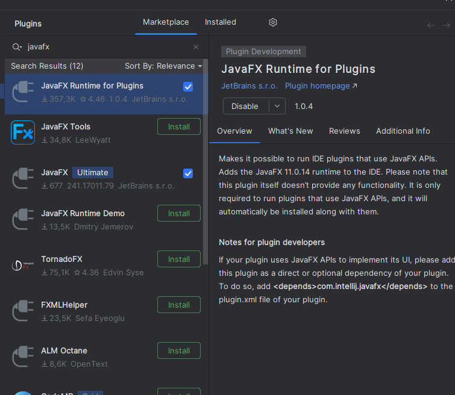

# KLJ Sportfeest planner
Dit project wordt gebruik voor het opstellen van een ringverdeling voor een sportfeest.

## Intiele setup stappen voor het project.
Voor het project te ontwikkelen wordt gebruik gemaakt van Intelij Idea.  
Hierbij zal men moeten starten met het installeren van de JavaFx plugin.
1. File => Settings => Plugins
2. Installeer "JavaFx Runtime for Plugins"  

## Referentie
Het orginele project is gestart door [Sam Verstraete](https://github.com/samverstraete).